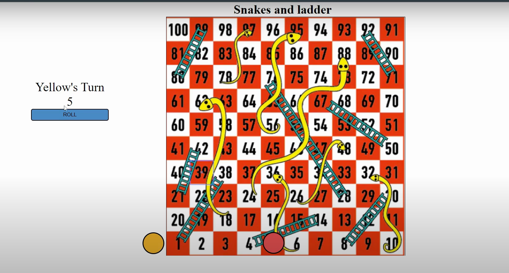

when button is clicked
get random number from 1 to 6 -> Math.floor(Math.random()*6+1) -> 1,2,3,4,5,6
change the players turn now.

errors stopped devellopment
Actual scenario:
1. intially both zero
2. when click on the button then get the random value
3. assign it to the player.

issue-1:
but before getting random number
we are setting the player count first.

sol:
    first get the number 
   then assign it to the player

Actual scenario:
1. when click on the button then retrive random number
2. after retriving assign it to the player

----------------------------------------------------

issue-2:
updating and utilizing the same state in a single func. 
React updates are asynchronous.

sol:
using useEffect 
fist retriving the random number and updating its value to state.
in useeffect, we call playerCount set.
also we pass number as deps.

----------------------------------------------------
Not completed yet.

issue-3:
when player landed on ladder then we have to update the player position immediately.

sol:
using useEffect 
fist retriving the random number and updating its value to state.
in useeffect, we call playerCount set.
also we pass number as deps.
